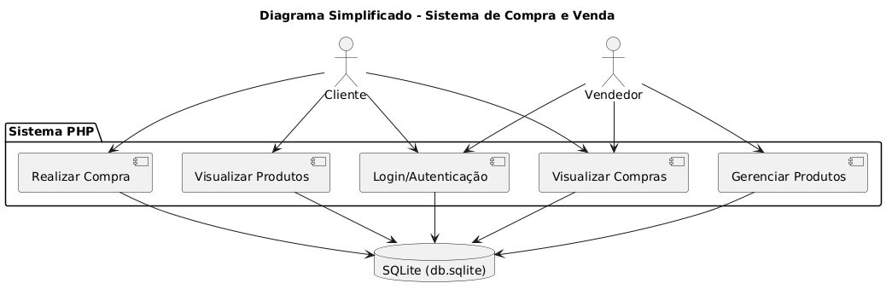

# 🛍️ Projeto Final - Sistema de Compra e Venda | DEV Evolution

<p align="left">
  
</p>

Este é um sistema prático de **compra e venda online**, desenvolvido em **PHP puro com SQLite**, como projeto final do curso **DEV Evolution**. O sistema permite o cadastro e login de clientes e vendedores, visualização e gestão de produtos, controle de permissões, reservas temporárias e registro de compras com atualização automática de estoque.

---

## 🔎 Visão Geral

O sistema foi pensado para simular um ambiente real de e-commerce em pequena escala, priorizando organização de código, controle de fluxo por tipo de usuário e funcionalidades úteis como:

* Reservas automáticas de produto por tempo
* Histórico de compras e vendas
* Geração de PDF
* Sistema de permissões e dashboards separados

---

## 🧰 Tecnologias Utilizadas

* **PHP**
* **SQLite** (banco de dados local e leve)
* **Composer** (para autoload e dependências)
* **Dompdf** (geração de PDF de comprovantes)
* **HTML/CSS** (páginas básicas)
* **PlantUML** (para diagramas de funcionamento)

---

## ✨ Funcionalidades

### 🧑‍💼 Vendedor

* Cadastro e login
* Dashboard exclusivo
* Cadastro, edição e exclusão de produtos
* Visualização das vendas realizadas de seus produtos

### 🛒 Cliente

* Cadastro e login
* Vitrine de produtos disponíveis
* Compra de produtos e sistema de reserva automática (120 segundos)
* Escolha de forma de pagamento (simulado)
* Histórico de compras
* Geração de comprovante de compra em PDF

---

## ✅ Funcionalidades Implementadas

* [x] Autenticação com controle de sessão
* [x] Cadastro e login de clientes e vendedores
* [x] Permissões por tipo de usuário
* [x] Dashboard separado por tipo de conta
* [x] Gestão completa de produtos (CRUD)
* [x] Carrinho de compras com reserva de 120s
* [x] Finalização de compra com desconto e forma de pagamento
* [x] Histórico de compras por cliente
* [x] Histórico de vendas por vendedor
* [x] Geração de comprovante PDF com Dompdf
* [x] Edição de perfil

---

## ⚙️ Como instalar e rodar localmente

### 🔧 Pré-requisitos

* PHP 7.4 ou superior
* [XAMPP](https://www.apachefriends.org/pt_br/index.html) ou outro servidor Apache + PHP
* Composer instalado

### 📦 Passo a Passo

1. **Clone o repositório:**

```bash
git clone https://github.com/amorais05/Projeto-Dev-Evolution.git
```

2. **Copie os arquivos para a pasta `htdocs` do XAMPP:**

```bash
C:\xampp\htdocs\Projeto-Dev-Evolution
```

3. **Instale as dependências PHP (se necessário):**

```bash
composer install
```

4. **Inicie o Apache pelo XAMPP.**

5. **Abra o navegador e acesse:**

```
http://localhost/Projeto-Dev-Evolution/public/login.php
```

> O banco `db.sqlite` já está incluso, e você pode testar com os arquivos `inserir_cliente_teste.php` e `inserir_produto_teste.php`.

---

## 📚 Diagrama de Funcionamento (PlantUML)



```
@startuml
title Diagrama Simplificado - Sistema de Compra e Venda

actor Cliente
actor Vendedor
database "SQLite (db.sqlite)" as DB

package "Sistema PHP" {
  [Login/Autenticação]
  [Gerenciar Produtos]
  [Visualizar Produtos]
  [Realizar Compra]
  [Visualizar Compras]
}

Cliente --> [Login/Autenticação]
Vendedor --> [Login/Autenticação]

Cliente --> [Visualizar Produtos]
Cliente --> [Realizar Compra]
Cliente --> [Visualizar Compras]

Vendedor --> [Gerenciar Produtos]
Vendedor --> [Visualizar Compras]

[Login/Autenticação] --> DB
[Gerenciar Produtos] --> DB
[Visualizar Produtos] --> DB
[Realizar Compra] --> DB
[Visualizar Compras] --> DB
@enduml

```
[🔗 Abrir no PlantUML](https://www.plantuml.com/plantuml/umla/VPAnJiCm48RtUufJ9nW2...)

---

## 📁 Estrutura do Projeto

```
Projeto-Dev-Evolution/
├── db.sqlite                  # Banco de dados SQLite
├── criar_banco.php           # Geração de schema (caso necessário)
├── inserir_cliente_teste.php # Cliente de teste
├── inserir_produto_teste.php # Produto de teste
├── src/                      # Código-fonte (Models, lógica de negócio)
│   └── Models/
│       ├── Usuario.php
│       ├── Produto.php
│       ├── Compra.php
│       └── Conexao.php
├── public/                   # Arquivos acessíveis via navegador
│   ├── login.php
│   ├── dashboard_cliente.php
│   ├── dashboard_vendedor.php
│   ├── produtos_disponiveis.php
│   ├── minhas_compras.php
│   └── ...
├── composer.json             # Dependências PHP
├── composer.lock
└── README.md
```

---

## 🧪 Funcionalidades Extras (Bônus)

* [x] Sistema de reserva com tempo limite (120s)
* [x] Exportação de comprovante em PDF
* [x] Controle de permissões entre clientes e vendedores
* [x] Validação de senha ao editar dados
* [ ] Upload de imagem de produto *(em planejamento)*
* [ ] Integração real com meios de pagamento *(simulado por enquanto)*
* [ ] Estilização moderna *(layout funcional, porém simples)*


## 🧑‍💻 Autoria

Desenvolvido por:
**Amanda Morais Martinelli**
📘 [Notion do Projeto](https://www.notion.so/Projeto-pr-tico-2209b6d7d7978037ae16f5b72712307b)


